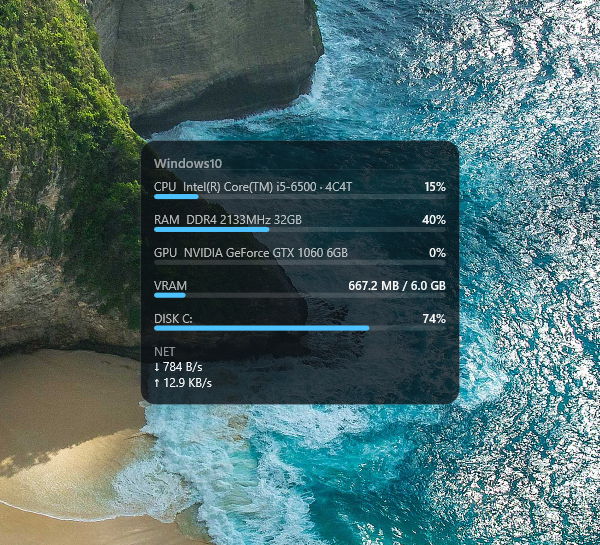
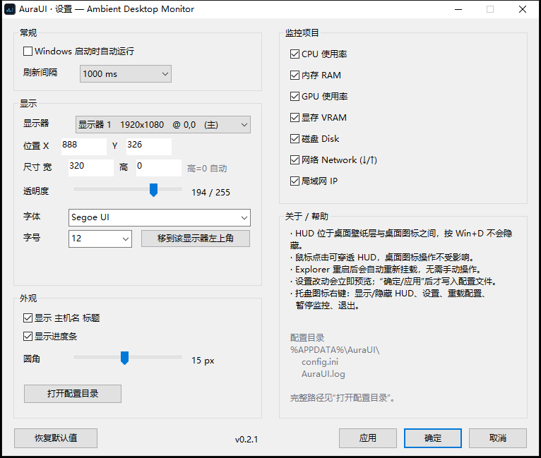

# AuraUI

一个原生、轻量的 Windows 桌面系统监控 HUD。程序把一块半透明信息面板挂在
**桌面壁纸层之上、桌面图标之下**，按 `Win+D` 不会消失，鼠标点击完全穿透。

<p align="center">
  
</p>

**主要特性**

* 嵌入桌面壁纸层：`Win+D` / 显示桌面不影响，不进任务栏和 Alt+Tab，点击穿透
* 实时监控 CPU / 内存 / GPU / 显存 / 磁盘 / 网络（N 卡经 NVML 动态加载，无 SDK 依赖）
* 纯原生：单 exe 约 2 MB，静态链接，无 .NET / Qt / Electron / 网络访问
* 设置窗口实时预览，托盘常驻，Explorer 崩溃 / 重启后自动恢复挂载

```
Windows Desktop
       │
       ├── Wallpaper          (壁纸)
       │
       ├── AuraUI HUD           <- 本项目
       │
       └── Desktop Icons      (桌面图标)
```

> Win32/DWM 深坑的完整记录（分层子窗口故障、残影、0x052C、托盘 v4 布局等）
> 见 [docs/technical-notes.md](docs/technical-notes.md)。

---

## 1. 技术栈

| 项 | 选择 |
|---|---|
| 语言 | C++20 |
| 窗口 | 纯 Win32 API |
| 渲染 | Direct2D + DirectWrite |
| 设置界面 | Windows Common Controls (comctl32 v6) |
| 构建 | CMake + MinGW-w64 |
| 配置 | INI (`GetPrivateProfile*`) |
| 依赖 | 仅 Windows 系统 DLL，**无 .NET / Qt / Electron / WebView / Node / Python** |

产物是**单个静态链接的 exe**（约 2 MB），除系统 DLL 外无任何运行时依赖，默认完全离线。

---

## 2. 构建

### 环境要求

* MinGW-w64（winlibs 发行版即可；本项目在 GCC 16.2.0 + binutils 2.44 上验证）
* CMake ≥ 3.20（随 winlibs 提供）
* **不需要 Visual Studio**

### 命令

下面把工具链根目录写作 `<MINGW>`（例如 `C:/mingw64`，按自己的解压位置替换）：

```bash
cmake -S . -B build -G "MinGW Makefiles" \
      -DCMAKE_BUILD_TYPE=Release \
      -DCMAKE_C_COMPILER="<MINGW>/bin/gcc.exe" \
      -DCMAKE_CXX_COMPILER="<MINGW>/bin/g++.exe" \
      -DCMAKE_RC_COMPILER="<MINGW>/bin/windres.exe"

cmake --build build --parallel
```

产物：`build/AuraUI.exe`。版本号的唯一来源是 `core/version.h`；同一个版本号还出现在
`assets/app.manifest` 的 `assemblyIdentity` 与 `CMakeLists.txt` 的
`project(... VERSION ...)` 里，**改版本时三处要一起改**，否则 exe 的版本资源、
SxS 标识与构建系统会互相不一致。

> **重新链接前先退出正在运行的 AuraUI**（托盘右键 → 退出），否则链接器
> 无法覆盖被占用的 exe（`Permission denied`）。

### ⚠️ MinGW-w64 的 manifest 链接坑

binutils ≥ 2.44 会自动链接 `lib/default-manifest.o`（自带 RT_MANIFEST 资源 ID 1），
项目自己的 `.rc` 若也用 ID 1 会直接报 `multiple non-default manifests`。
本项目把自有 manifest 放在 **ID 2**，运行时用 `CreateActCtxW` 显式激活拿到
Common Controls v6；DPI 感知经 `SetProcessDpiAwarenessContext` 运行时设置。
日志会打印实际绑定的 comctl32 路径（应为 WinSxS 的 6.x 版本）。

---

## 3. 使用

托盘图标：左键单击（或键盘激活）打开设置，右键弹菜单。

```
显示 / 隐藏 HUD
设置...
移动 HUD 位置...
──────────
重新加载配置
暂停监控        <- 暂停后文字变为"开始监控"
──────────
退出
```

* 移动 HUD 位置 → HUD 脱离桌面层、置顶可拖动（整个面板即标题栏），
  双击或右键落点，位置写入配置；对隐藏中的 HUD 使用会顺带显示并持久化。
* 设置窗口：改动实时预览到 HUD；"取消"不落盘、"应用"生效、"确定"生效并关闭；
  宽度不足时自动抬高并弹窗说明（文字宽度护栏）。

<p align="center">
  
</p>

---

## 4. 监控数据

| 指标 | API |
|---|---|
| CPU | `GetSystemTimes` 两次采样求 delta |
| 内存 | `GlobalMemoryStatusEx` |
| 磁盘 | `GetDiskFreeSpaceExW`（默认系统盘） |
| 网络速率 | `GetIfTable2` 的 64 位 In/OutOctets 计数 |
| 网卡 / IP / MAC / 网关 | `GetAdaptersAddresses` |
| GPU / 显存 / 温度 / 功耗 | **NVML 动态加载**，无 SDK 依赖 |
| GPU 型号（非 N 卡回退） | DXGI `EnumAdapters1` |

* 采集全部在**后台采样线程**完成，UI 线程只做一次 `Snapshot` 拷贝与绘制。
* 没有 NVIDIA 显卡 / 没有网卡 / 磁盘不存在时显示 `N/A`，**不会崩溃**。
* 自愈：NVML 失联（驱动重置/TDR）约 5 秒自动重新初始化；网卡切换时速率
  基线重新起步，不出现跨卡假尖峰。
* 不访问任何网络接口，**公网 IP 不在默认功能内**。

刷新间隔：100 / 250 / 500 / 1000 / 2000 / 5000 ms（默认 1000 ms）。

---

## 5. 配置

位置：`%APPDATA%\AuraUI\config.ini`
日志：`%APPDATA%\AuraUI\AuraUI.log`（超过 512 KB 自动轮转）

```ini
[Meta]
Format=2           ; 序列化版本

[General]
AutoStart=0
RefreshInterval=1000
Paused=0

[Display]
Monitor=0          ; 0 = 主显示器（EnumDisplayMonitors 序）
X=80               ; 相对所选显示器左上角的像素偏移
Y=80
Width=320
Height=0           ; 0 = 按内容自适应高度
Opacity=205        ; 0..255
Font=Segoe UI
FontSize=14

[Monitor]
CPU=1
Memory=1
GPU=1
VRAM=1
Disk=1
Network=1
LANIP=1

[Appearance]
ShowTitle=1
ShowBars=1
CornerRadius=10
Padding=14
Background=0A0E14  ; RRGGBB
Accent=4CC2FF

[State]
HudVisible=1
```

* 文件以系统代码页（CP_ACP）存取——实测本机 profile API 不认 UTF-16 BOM；
  设置里的字体下拉已过滤掉代码页无法表示的名字（避免存成 `??`）。
* 手改配置在下次"应用/确定"前一直有效；`X/Y` 完全落到目标显示器之外时
  会在放置时夹回屏内。
* 开机自启写 `HKCU\...\Run`（值名 `AuraUI`），不需要管理员权限，也不装服务；
  启动时按配置双向对齐（手改 `AutoStart=0` 会清掉残留键）。

---

## 6. 原理速览

完整机制与实证记录都在 [docs/technical-notes.md](docs/technical-notes.md)，这里只留结论：

* **挂载**：`0x052C(0xD,0x1)` 让 shell 建出壁纸层 WorkerW（参数错了静默无效），
  HUD 以 `WS_CHILD` 挂到"可见、属于 Explorer、不含 `SHELLDLL_DefView`"的
  壁纸层上，`HWND_BOTTOM` 插到图标正下方。绝不挂 Progman、绝不用 `HWND_TOPMOST`。
* **挂载态不用分层窗口**：跨进程 reparent 后分层子窗口在本机不参与合成
  （API 全部返回成功但不上屏），挂载态走普通 GDI 子窗口 + `WM_PAINT`/`BitBlt`。
* **半透明 = 壁纸垫底**：解码 shell 实际显示的壁纸缓存（`CachedImage_*` 层）
  按摆放样式裁成面板尺寸的不透明裁片垫在面板下，再画半透明面板——
  视觉等价透明，表面不透明、`BitBlt` 安全。裁片在后台线程生成（latest-wins）。
* **残影**：WorkerW 从不重绘被腾出的区域，HUD 移动/隐藏后最后一帧会僵死在
  桌面上。修复是跨进程 `BitBlt` 直接绘制壁纸像素覆盖（零闪动），SPI 壁纸
  重放仅作解码失败 / 会话重连的兜底；多个腾出矩形 250 ms 去抖合并刷新。
* **自愈**：Explorer 重启（`TaskbarCreated` + 2 秒健康检查）自动重建托盘、
  重建/重挂 HUD；`WM_DISPLAYCHANGE`/`WM_DEVICECHANGE` 重新排版并刷新网卡。

---

## 7. 诊断

```bash
# 离屏渲染一帧到 BMP（不需要桌面会话，用于验证渲染器）
AuraUI.exe --dump hud_preview.bmp

# 输出调试级日志（托盘逐事件回调等，写入 AuraUI.log 的 DBG 行）
AuraUI.exe --verbose
```

> 跨进程读写控件文本必须用 `WM_GETTEXT`/`WM_SETTEXT`
> （`GetWindowText` 对其它进程的控件静默失效）。

---

## 8. 项目结构

```
AuraUI/
├── CMakeLists.txt
├── assets/          app.rc, app.manifest, icon.ico
├── src/main.cpp     wWinMain、manifest 激活、DPI、单实例
├── app/             消息窗口、托盘、定时器、Explorer 生命周期、配置编排
├── core/            RAII 包装、错误格式化、日志、路径、版本号
├── config/          Config 结构 + INI 读写 + 开机自启
├── desktop/         Progman/WorkerW/SHELLDLL_DefView 发现与挂载、壁纸绘制
├── hud/             窗口、Direct2D/DirectWrite 渲染、壁纸垫底、主题
├── monitor/         CPU / 内存 / 磁盘 / 网络 / 采样线程 / Snapshot
├── system/          NVML 动态绑定与 GPU 采集
├── settings/        Win32 Common Controls 设置窗口
├── tray/            托盘图标与右键菜单
├── docs/            技术笔记（深坑与实证）
```

---

## 9. 已知限制

* AMD / Intel GPU 使用率暂未实现（显示 `N/A`，型号通过 DXGI 显示）。
* 磁盘目前固定为系统盘，未提供多盘选择。
* INI 为系统代码页存储：代码页不可表示的字体名不在设置下拉中提供
  （手改这类值在保存时仍会变成 `??`）。
* TILE / SPAN 摆放与纯色桌面回退纯色垫底（面板透明度仍生效，垫底非真实壁纸）。
* `Win+D` / 锁屏 / 分辨率热插拔已在代码路径上处理，但无交互桌面会话
  （如断开的 RDP）中无法完整人工验证。
* 可继续扩展：主题配色、字体粗细、动画过渡、多盘选择。

---

## 10. 许可证

MIT，见 [LICENSE](LICENSE)。
